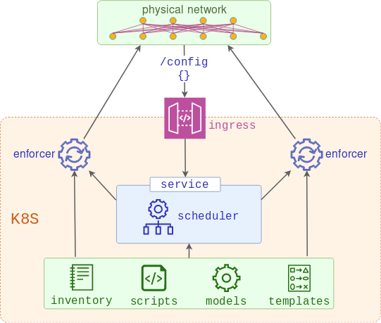

# PoC demonstration of Network-as-a-Service concept

## Part 1 - Building the foundation

At this stage there are two microservices involved:

* Scheduler - receives API requests with the list of devices to be configured and schedules the job runners to push it
* Enforcer - one or many job runners created by scheduler, combining the models and templates and using the result to replace the running configuration of the devices.



### 1. Build the test topology

This step assumes you have [docker-topo][docker-topo] installed and c(vEOS) image [built][cveos] and available in local docker registry.

```
make topo
```

This test topology can be any Arista EOS device reachable from the localhost. If using a different test topology, be sure to update the [inventory](topo/inventory.yaml) file.

### 2. Build the local Kubernetes cluster

The following step will build a docker-based [kind][kind] cluster with a single control plane and a single worker node.

```
make kubernetes
```

### 3. Check that the cluster is functional

The following step will build a 100MB docker image and push it to dockerhub. It is assumed that the user has done `docker login` and has his username saved in `DOCKERHUB_USER` environment variable. 

```
export KUBECONFIG="$(kind get kubeconfig-path --name="naas")"
make warmup
kubectl get pod test
```

This image will be used by all other services, so it may take a few minutes for test pod to transition from `ContainerCreating` to `Running`

### 4. Deploy the services

This next command will perform the following steps:

1. Upload enforcer scripts as configmaps
2. Create Traefik daemonset to be used as ingress
3. Upload generic device model along with its template and label them accordingly
4. Create scheduler deployment, service and ingress resources

```
make scheduler-build
```

If running as non-root, the user may be prompted for a sudo password.


### 5. Test the app

Issue an API call to configure all devices in the inventory

```bash
./me.sh
```

Make sure the configuration has been pushed

```
make schedule-logs
```

Test the configuration-compliance enforcer from any device (the last command should show the alias being re-added a few seconds later)

```
show run | include alias
configure
no alias FOO
end
show run | include alias
write memory
show run | include alias
```


### Cleanup

```
make clean
```

[docker-topo]: https://github.com/networkop/docker-topo
[cveos]: https://github.com/networkop/docker-topo/tree/master/topo-extra-files/veos
[kind]: https://github.com/kubernetes-sigs/kind