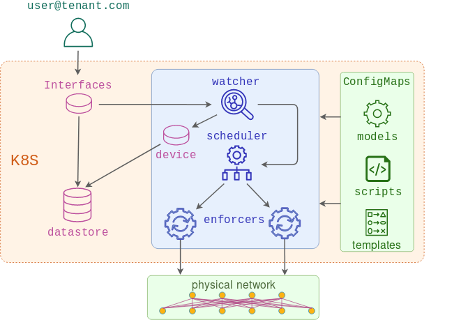

# PoC demonstration of Network-as-a-Service concept

## Part 2 - Designing a Network API

At this stage there are three microservices involved:

* **Watcher** - listens to incoming API events and generates an interface data model based on them
* **Scheduler** - receives API requests with the list of devices to be configured and schedules the job runners to push it
* **Enforcer** - one or many job runners created by scheduler, combining the models and templates and using the result to replace the running configuration of the devices.



### 1. Build the test topology

This step assumes you have [docker-topo][docker-topo] installed and c(vEOS) image [built][cveos] and available in local docker registry.

```
make topo
```

This test topology can be any Arista EOS device reachable from the localhost. If using a different test topology, be sure to update the [inventory](topo/inventory.yaml) file.

### 2. Build the local Kubernetes cluster

The following step will build a docker-based [kind][kind] cluster with a single control plane and a single worker node.

```
make kubernetes
```

### 3. Check that the cluster is functional

The following step will build a 100MB docker image and push it to dockerhub. It is assumed that the user has done `docker login` and has his username saved in `DOCKERHUB_USER` environment variable. 

```
export KUBECONFIG="$(kind get kubeconfig-path --name="naas")"
make warmup
kubectl get pod test
```

This image will be used by all other services, so it may take a few minutes for test pod to transition from `ContainerCreating` to `Running`

### 4. Deploy the scheduler/enforcer services

The next command will perform the following steps:

1. Upload scheduler and enforcer scripts as configmaps
2. Create Traefik daemonset to be used as ingress
3. Upload generic device model along with its template and label them accordingly
4. Create scheduler deployment, service and ingress resources

```
make scheduler-build
```

If running as non-root, the user may be prompted for a sudo password.


### 5. Deploy the watcher service

```
make watcher-build
```

The above command will perform the following steps:
1. Create two namespaces that will represent different platform tenants
2. Create `Interface` and `Device` CRD objects describing our custom API
3. Deploy interface-watcher and device-watcher controllers along with the necessary RBAC rules
4. Upload interface jinja template to be used by the enforcers

### 5. Test the app

Issue the first `Interface` API call:

```bash
kubectl apply -f crds/03_cr.yaml         
```

Check the logs of the interface-watcher controller to make sure it has picked up the `Interface` API ADDED event:

```
kubectl logs deploy/interface-watcher
2019-06-20 08:20:01 INFO interface-watcher - interface_watcher: Watching Interface CRDs
2019-06-20 08:20:09 INFO interface-watcher - process_services: Received ADDED event request-001 of Interface kind
2019-06-20 08:20:09 INFO interface-watcher - process_service: Processing ADDED config for Vlans 10 on device devicea
2019-06-20 08:20:09 INFO interface-watcher - get_device: Reading the devicea device resource
```

Check the logs of the device-watcher controller to make sure it has detected the `Device` API event:

```
kubectl logs deploy/device-watcher
2019-06-20 08:20:09 INFO device-watcher - update_configmaps: Updating ConfigMap for devicea
2019-06-20 08:20:09 INFO device-watcher - update_configmaps: Creating configmap for devicea
2019-06-20 08:20:09 INFO device-watcher - update_configmaps: Configmap devicea doesn't exist yet. Creating
```

Check the logs of the scheduler service to see if it has been notified about the change:

```
kubectl logs deploy/scheduler
2019-06-20 08:20:09 INFO scheduler - webhook: Got incoming request from 10.32.0.4
2019-06-20 08:20:09 INFO scheduler - webhook: Request JSON payload {'devices': ['devicea', 'deviceb']}
2019-06-20 08:20:09 INFO scheduler - create_job: Creating job job-6rlwg0
```

Check the logs of the enforcer service to see if device configs have been generated and pushed:

```
kubectl logs jobs/job-6rlwg0
2019-06-20 08:20:18 INFO enforcer - push_configs: Downloading Model configmaps
2019-06-20 08:20:18 INFO enforcer - get_configmaps: Retrieving the list of ConfigMaps matching labels {'app': 'naas', 'type': 'model'}
2019-06-20 08:20:18 INFO enforcer - push_configs: Found models: ['devicea', 'deviceb', 'generic-cm']
2019-06-20 08:20:18 INFO enforcer - push_configs: Downloading Template configmaps
2019-06-20 08:20:18 INFO enforcer - get_configmaps: Retrieving the list of ConfigMaps matching labels {'app': 'naas', 'type': 'template'}
```

Finally, we can check the result on the device itself:

```
devicea#sh run int eth1
interface Ethernet1
   description request-001
   switchport trunk allowed vlan 10
   switchport mode trunk
```

### Cleanup

```
make clean
```

[docker-topo]: https://github.com/networkop/docker-topo
[cveos]: https://github.com/networkop/docker-topo/tree/master/topo-extra-files/veos
[kind]: https://github.com/kubernetes-sigs/kind